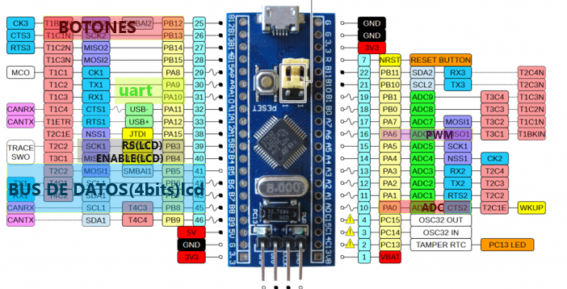
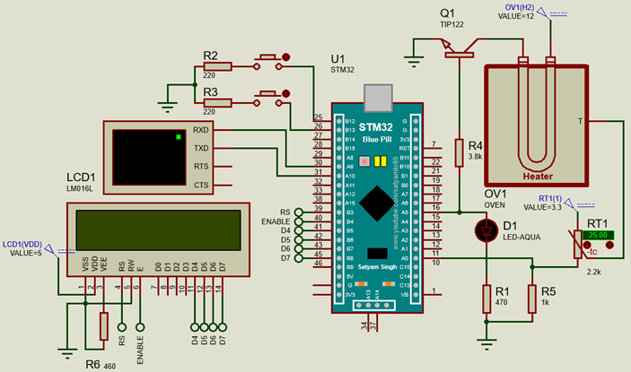
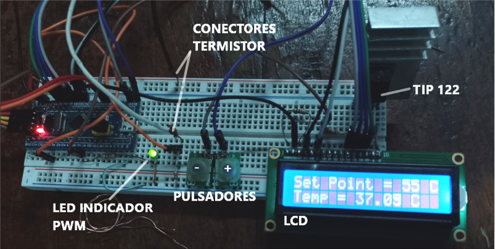

# PROYECTO DE ISTD
## *Implementacion en la blue-pill de adc con dma, pwm, uart y pantalla LCD 2x16*
   - uso del adc(12 bits) para obrtener valores usados para controlar el pwm y enviar el valor directo a pc por el puerto uart a 115200 baud
   - uart -> pin A9(tx), A10(rx)
   - adc -> pin A0
   - pwm -> pin A6
   - uso de una pantalla lcd 2x16 para mostrar el set point y la temperatura actual 

### Pin Out   

### Circuito

### Implementacion  
